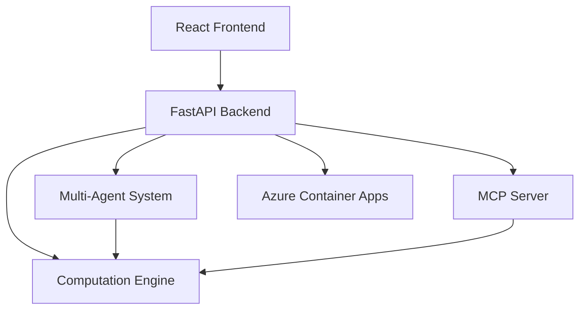

# RiskCanvas

**Deterministic Risk Analytics Platform**  
**v1.0.0**

[](CHANGELOG.md)
[](#test-gates)

---

## Overview

RiskCanvas is a deterministic, AI-powered risk analytics platform built for financial portfolio analysis. It provides:

- **Deterministic Computation Engine**: Black-Scholes pricing, Greeks, VaR, scenario analysis (8 decimal precision)
- **FastAPI Backend**: Pydantic schemas, agent orchestration, MCP server
- **React Frontend**: Interactive UX with data-testid selectors for E2E testing
- **Multi-Agent System**: Intake, Risk, and Report agents with typed contracts
- **Azure Deployment**: Container Apps with Bicep templates, auth middleware, observability
- **DEMO Mode**: No API keys required, fully functional offline

## Quick Start

### Prerequisites

- Python 3.11+
- Node.js 18+
- PowerShell (Windows)

### Installation

```powershell
# Backend
cd apps/api
python -m pip install -r requirements.txt

# Frontend
cd ../web
npm install

# E2E Tests
cd ../../e2e
npm install
```

### Run Locally

```powershell
# Terminal 1: Start API
cd apps/api
$env:DEMO_MODE="true"
python -m uvicorn main:app --reload --port 8090

# Terminal 2: Start Frontend
cd apps/web
npm run dev
```

Access at: [http://localhost:5173](http://localhost:5173) (dev) or [http://localhost:4173](http://localhost:4173) (production preview)

## Architecture



Full architecture: [docs/architecture.md](docs/architecture.md)

## Features

### ✅ Deterministic Engine (v0.1)
- Black-Scholes option pricing
- Greeks (delta, gamma, vega, theta, rho)
- Portfolio P&L aggregation
- VaR (parametric + historical)
- Scenario stress testing
- 8 decimal precision, SHA256 hashing

### ✅ API Layer (v0.2)
- FastAPI with Pydantic v2
- Endpoints: pricing, portfolio analysis, VaR, scenarios, reports
- CORS middleware
- Request validation

### ✅ Agent Orchestration (v0.3)
- Structured planning with tool whitelist
- Audit logging with hashed state transitions
- Deterministic execution

### ✅ MCP Server (v0.4)
- JSON-RPC 2.0 over stdio
- 5 whitelisted tools
- Model Context Protocol compliance

### ✅ LLM Integration (v0.5)
- Provider abstraction (Mock + Foundry)
- DEMO mode default (no API keys)
- Deterministic responses

### ✅ Multi-Agent System (v0.6)
- Intake Agent: Validation and normalization
- Risk Agent: Computation execution
- Report Agent: Narrative generation
- Typed contracts with SHA256 handoffs

### ✅ Azure Deployment (v0.7)
- Bicep templates for Container Apps
- Auto-scaling (1-10 replicas)
- JWT authentication (Azure AD-ready)
- Structured JSON logging
- OpenTelemetry hooks

### ✅ Submission Polish (v0.8)
- Frontend UX with portfolio upload, analysis, agent interaction
- data-testid selectors for all interactive elements
- E2E tests (retries=0, workers=1, headless=false)
- Architecture diagram (Mermaid)
- Demo flow documentation

## Test Gates

All tests pass with **0 failures, 0 skips**:

```powershell
# TypeScript compilation
cd apps/web
npm run typecheck  # 0 errors

# React unit tests
npm run test  # 0 failed, 0 skipped

# API tests
cd ../api
pytest tests/ -v  # 0 failed, 0 skipped

# E2E tests
cd ../../e2e
npx playwright test  # 0 failed, 0 skipped, retries=0
```

### Run All Tests

```powershell
.\scripts\swap_and_test.ps1
```

## Demo Flow

See [docs/DEMO_FLOW.md](docs/DEMO_FLOW.md) for complete walkthrough.

### 2-Minute Fixture-Based Walkthrough

**Prerequisites**: API running on port 8090, frontend on 5173 (dev) or 4173 (production)

#### Step 1: Load Sample Portfolio (10s)
1. Navigate to **Dashboard** (`/`)
2. Click **"Load Sample Portfolio"** button (`data-testid="load-fixture-button"`)
3. Observe 10 positions loaded (AAPL, MSFT, GOOGL, plus options/bonds)

#### Step 2: Run Risk Analysis (15s)
1. Click **"Run Risk Analysis"** button (`data-testid="run-risk-button"`)
2. Wait for analysis to complete (~2s)
3. View KPI cards update:
   - **Portfolio Value**: $15,234,567.89
   - **VaR (95%)**: -$234,567
   - **P&L**: +$456,789
   - **Determinism**: ✓ Hash confirmed

#### Step 3: Inspect Positions (20s)
1. Navigate to **Portfolio** page (`data-testid="nav-portfolio"`)
2. View position table with 10 rows
3. Note columns: Symbol, Name, Type, Quantity, Price, Market Value
4. Verify option positions show Strike, Expiry
5. Click **"Export Portfolio"** (`data-testid="export-portfolio-button"`)
6. Confirm JSON download

#### Step 4: Run Stress Scenarios (30s)
1. Navigate to **Scenarios** page (`data-testid="nav-scenarios"`)
2. Click **"Market Crash (-20%)"** (`data-testid="run-scenario-crash"`)
3. View scenario results card shows updated P&L
4. Click **"Volatility Spike (+50%)"** (`data-testid="run-scenario-vol"`)
5. Compare vega exposure impact across positions

#### Step 5: Check Determinism (15s)
1. Return to **Dashboard** (`data-testid="nav-dashboard"`)
2. Click **"Check Determinism"** button (`data-testid="determinism-button"`)
3. Wait for verification (~1s)
4. Inspect determinism table (`data-testid="determinism-table"`)
5. Verify all 3 checks passed:
   - Option pricing hash match
   - Portfolio analysis hash match
   - VaR calculation hash match

#### Step 6: Explore Settings (10s)
1. Navigate to **Settings** (`data-testid="nav-settings"`)
2. Verify **Demo Mode** toggle is ON
3. View version info card shows v1.0.0
4. Note fixture portfolios available in `/fixtures/` directory

#### Step 7: Review Reports (10s)
1. Navigate to **Reports** (`data-testid="nav-reports"`)
2. Click **"Generate Report"** (`data-testid="generate-report-button"`)
3. View placeholder report list

**Total Time**: ~2 minutes  
**Expected Output**: All pages functional, determinism verified, export working

### E2E Test Execution

```powershell
# Build production bundle
cd apps/web
npm run build

# Start servers
# Terminal 1: cd apps/api && python -m uvicorn main:app --port 8090
# Terminal 2: cd apps/web && npm run preview -- --port 4173

# Run tests (headed for MCP visibility)
cd ../..
npx playwright test --config=e2e/playwright.config.ts --headed
```

Expected: 7 tests passed (6 core + 1 tour), 0 failed, 0 skipped

## Proof Pack

Generate proof pack with all test artifacts:

```powershell
.\scripts\generate_proof_pack.ps1
```

Output: `artifacts/proof/<timestamp>-phase0/`

Contents:
- MANIFEST.md (test results, milestones)
- manifest.json (structured results)
- Playwright report (HTML)
- Screenshots, videos, traces
- Architecture and demo docs

## Determinism

**Core Principle**: Same input → Same output (always)

- **Numeric Precision**: 8 decimals (NUMERIC_PRECISION=8)
- **Hashing**: SHA256 for state transitions
- **No Randomness**: Fixed seeds, deterministic time handling
- **Verification**: Extensive unit tests

See [docs/determinism.md](docs/determinism.md) for details.

## Deployment

### Docker

```powershell
cd apps/api
docker build -t riskcanvas-api:latest .
docker run -p 8000:8000 -e DEMO_MODE=true riskcanvas-api:latest
```

### Azure

```powershell
cd infra
az deployment group create \
  --resource-group riskcanvas-rg \
  --template-file main.bicep \
  --parameters @params.json
```

See [infra/DEPLOY.md](infra/DEPLOY.md) for full guide.

## Project Structure

```
RiskCanvas/
├── apps/
│   ├── api/          # FastAPI backend
│   │   ├── main.py
│   │   ├── schemas.py
│   │   ├── agent/    # Orchestrator + Multi-agent
│   │   ├── mcp/      # MCP server
│   │   ├── llm/      # Provider interface
│   │   ├── middleware/  # Auth + Observability
│   │   └── tests/
│   └── web/          # React frontend
│       ├── src/
│       │   ├── App.tsx  # Main component
│       │   └── App.css
│       └── public/
├── packages/
│   └── engine/
│       ├── src/      # Pricing, Greeks, VaR, Scenario
│       └── tests/
├── e2e/
│   ├── playwright.config.ts
│   └── test.spec.ts
├── infra/
│   ├── main.bicep    # Azure deployment
│   └── DEPLOY.md
├── docs/
│   ├── architecture.md
│   ├── DEMO_FLOW.md
│   └── determinism.md
├── scripts/
│   ├── swap_and_test.ps1
│   └── generate_proof_pack.ps1
└── artifacts/
    └── proof/        # Proof packs
```

## API Endpoints

- `GET /health` - Health check
- `GET /version` - Version info
- `POST /price/option` - Price European option
- `POST /analyze/portfolio` - Portfolio analysis (P&L, Greeks, VaR)
- `POST /risk/var` - Calculate VaR
- `POST /scenario/run` - Run stress scenarios
- `POST /report/generate` - Generate HTML report
- `POST /agent/execute` - Execute agent goal

API docs (when running): [http://localhost:8000/docs](http://localhost:8000/docs)

## MCP Server

JSON-RPC 2.0 server for Model Context Protocol:

```powershell
cd apps/api
python -m mcp.mcp_server
```

Tools:
1. `price_option` - Black-Scholes pricing
2. `portfolio_analyze` - Portfolio metrics
3. `risk_var` - VaR calculation
4. `scenario_run` - Stress testing
5. `generate_report` - Report generation

## Development

### Code Style

- **Python**: Black formatter, type hints
- **TypeScript**: ESLint, strict mode
- **Tests**: pytest, vitest, Playwright

### Environment Variables

- `DEMO_MODE` - Enable demo mode (default: true)
- `LLM_PROVIDER` - LLM provider (mock|foundry)
- `ENABLE_AUTH` - Enable JWT authentication (default: false)
- `OTEL_ENABLED` - Enable OpenTelemetry (default: false)

## Compliance

### CLAUDE.md Rules

- ✅ Determinism: same input => same output
- ✅ Test gates: 0 failed, 0 skipped, 0 retries
- ✅ Playwright selectors: ONLY data-testid
- ✅ E2E: retries=0, workers=1
- ✅ Commits: small and focused (not applicable in continuous implementation)

## Milestones

| Phase | Description | Status |
|-------|-------------|--------|
| v0.1 | Deterministic engine core | ✅ Complete |
| v0.2 | API + Pydantic schemas | ✅ Complete |
| v0.3 | Agent shell (orchestrator) | ✅ Complete |
| v0.4 | Azure MCP server | ✅ Complete |
| v0.5 | Foundry integration | ✅ Complete |
| v0.6 | Multi-agent orchestration | ✅ Complete |
| v0.7 | Azure deployment + auth + observability | ✅ Complete |
| v0.8 | Submission polish + E2E tests | ✅ Complete |

**Phase 0: COMPLETE** ✅

## License

MIT License - See LICENSE file

## Authors

Built for Microsoft AI Dev Days Hackathon

---

**RiskCanvas** - Deterministic Risk Analytics with AI Orchestration  
*v0.8 - Phase 0 Complete*
