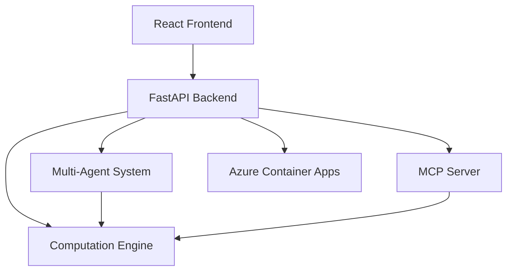

# RiskCanvas

**Deterministic Risk Analytics Platform**  
**v5.21.0**

[](CHANGELOG.md)
[](#test-gates)
[](#wave-13-14-market-data--cache-v2--hedge-studio-pro--decision-memo)
[](#frontend-testing-v450)

---

## Overview

RiskCanvas is a deterministic, AI-powered risk analytics platform built for financial portfolio analysis. It provides:

- **Deterministic Computation Engine**: Black-Scholes pricing, Greeks, VaR, scenario analysis (8 decimal precision)
- **FastAPI Backend**: Pydantic schemas, agent orchestration, MCP server
- **React Frontend**: Interactive UX with data-testid selectors for E2E testing
- **Multi-Agent System**: Intake, Risk, and Report agents with typed contracts
- **Azure Deployment**: Container Apps with Bicep templates, auth middleware, observability
- **DEMO Mode**: No API keys required, fully functional offline

## Quick Start

### Prerequisites

- Python 3.11+
- Node.js 18+
- PowerShell (Windows)

### Installation

```powershell
# Backend
cd apps/api
python -m pip install -r requirements.txt

# Frontend
cd ../web
npm install

# E2E Tests
cd ../../e2e
npm install
```

### Run Locally

**Production Mode** (default):
```powershell
# Terminal 1: Start API (DEMO_MODE=false by default)
cd apps/api
python -m uvicorn main:app --reload --port 8090

# Terminal 2: Start Frontend
cd apps/web
npm run dev
```

**DEMO Mode** (no authentication, uses demo headers):
```powershell
# Terminal 1: Start API with DEMO mode enabled
cd apps/api
$env:DEMO_MODE="true"
python -m uvicorn main:app --reload --port 8090

# Terminal 2: Start Frontend with DEMO mode
cd apps/web
$env:VITE_DEMO_MODE="true"
npm run dev
```

For **E2E testing** with production build:
```powershell
# Build frontend with DEMO mode
cd apps/web
$env:VITE_DEMO_MODE="true"
npm run build

# Serve production build
npx vite preview --port 4174

# In another terminal, run E2E tests
cd ../../e2e
npx playwright test --config=playwright.config.ts
```

**Runtime DEMO mode toggle**: In browser console, run:
```javascript
localStorage.setItem('RC_DEMO_MODE', 'true');
window.location.reload();
```

Access at:
- Development: [http://localhost:5173](http://localhost:5173)
- Production preview: [http://localhost:4174](http://localhost:4174)
- API docs: [http://localhost:8090/docs](http://localhost:8090/docs)

## Wave 5 Proof Automation

v2.8.0 ships a **one-command proof runner** that builds, tests, and captures every artifact needed to certify Wave 5 ACCEPTED status.

```powershell
# Run the complete Wave 5 proof suite (requires backend + frontend prerequisites)
.\scripts\proof\run_wave5.ps1
```

### What it does

| Step | Tool | Gate |
|------|------|------|
| TypeScript check | `tsc --noEmit` | 0 type errors |
| Frontend build | `vite build` | build succeeds |
| Harness tests | `playwright --project uiunit` | 0 failed, retries=0 |
| Backend tests | `pytest tests/` | 0 failed, 0 skipped |
| Phase 5 media tour | `playwright (slowMo:4000)` | TOUR.webm >= 180 s, >= 25 screenshots |
| Full E2E suite | `playwright` | 0 failed, retries=0 |

### Proof pack output

The script deposits all artifacts in `proof-pack/<timestamp>/`:

```
proof-pack/20260218-150000/
├── MANIFEST.md          ← human-readable summary
├── manifest.json        ← machine-readable results
├── TOUR.webm            ← full tour video (>= 180 s)
├── screenshots/         ← 34 full-page phase5 screenshots
├── logs/                ← all step logs
└── playwright-report/   ← HTML test report
```

### Skip media (fast CI)

```powershell
.\scripts\proof\run_wave5.ps1 -SkipMedia
```

## Architecture



Full architecture: [docs/architecture.md](docs/architecture.md)

## Features

### ✅ Deterministic Engine (v0.1)
- Black-Scholes option pricing
- Greeks (delta, gamma, vega, theta, rho)
- Portfolio P&L aggregation
- VaR (parametric + historical)
- Scenario stress testing
- 8 decimal precision, SHA256 hashing

### ✅ API Layer (v0.2)
- FastAPI with Pydantic v2
- Endpoints: pricing, portfolio analysis, VaR, scenarios, reports
- CORS middleware
- Request validation

### ✅ Agent Orchestration (v0.3)
- Structured planning with tool whitelist
- Audit logging with hashed state transitions
- Deterministic execution

### ✅ MCP Server (v0.4)
- JSON-RPC 2.0 over stdio
- 5 whitelisted tools
- Model Context Protocol compliance

### ✅ LLM Integration (v0.5)
- Provider abstraction (Mock + Foundry)
- DEMO mode default (no API keys)
- Deterministic responses

### ✅ Multi-Agent System (v0.6)
- Intake Agent: Validation and normalization
- Risk Agent: Computation execution
- Report Agent: Narrative generation
- Typed contracts with SHA256 handoffs

### ✅ Azure Deployment (v0.7)
- Bicep templates for Container Apps
- Auto-scaling (1-10 replicas)
- JWT authentication (Azure AD-ready)
- Structured JSON logging
- OpenTelemetry hooks

### ✅ Submission Polish (v0.8)
- Frontend UX with portfolio upload, analysis, agent interaction
- data-testid selectors for all interactive elements
- E2E tests (retries=0, workers=1, headless=false)
- Architecture diagram (Mermaid)
- Demo flow documentation

---

## Wave 41-48: Enterprise Layer (v4.98.0-v5.21.0)

### ✅ Tenancy v2 + RBAC (Wave 41, v4.98.0-v5.01.0)
- `tenancy_v2.py`: 3 demo tenants, 4 demo users, `has_permission()`, `require_perm()`
- Roles: OWNER / ADMIN / ANALYST / VIEWER with scoped permission sets
- **Endpoints**: `GET /tenants`, `GET /tenants/{id}/members`, `POST /tenants/{id}/members`, `GET /tenants/~context`
- **Frontend**: `AdminPage.tsx` (tenant/member management + audit log), `TenantSwitcher.tsx`

### ✅ Artifact Registry (Wave 42, v5.02.0-v5.05.0)
- `artifacts_registry.py`: 5 demo artifacts with deterministic SHA-256 IDs
- **Endpoints**: `GET /artifacts`, `GET /artifacts/{id}`, `GET /artifacts/{id}/downloads`
- **Frontend**: `ArtifactsPage.tsx`, `EvidenceBadge.tsx`

### ✅ Attestations (Wave 43, v5.06.0-v5.09.0)
- `attestations.py`: per-tenant hash chain with `issue_attestation()`, `get_chain_head()`, `build_receipts_pack()`
- **Endpoints**: `GET /attestations`, `GET /attestations/{id}`, `POST /attestations/receipts-pack`
- **Frontend**: `AttestationsPage.tsx` with chain navigation, `PermissionBadge.tsx`

### ✅ Compliance Pack (Wave 44, v5.10.0-v5.13.0)
- `compliance_pack.py`: SOC2-ish 7-file evidence bundle generator + manifest verifier
- **Endpoints**: `POST /compliance/generate-pack`, `GET /compliance/packs/{id}`, `POST /compliance/packs/{id}/verify`
- **Frontend**: `CompliancePage.tsx`

### ✅ Judge Mode v2 (Wave 47, v5.18.0-v5.21.0)
- `judge_mode_v2.py`: 3-vendor hackathon judge packs (microsoft, gitlab, digitalocean)
- **Endpoints**: `POST /judge/v2/generate`, `GET /judge/v2/packs`, `GET /judge/v2/definitions`
- **Tests**: 72 new pytest tests; total suite 1087 passing, 0 failed

---

## Wave 13+14: Market Data / Cache v2 / Hedge Studio Pro / Decision Memo (v4.6–v4.9) {#wave-13-14-market-data--cache-v2--hedge-studio-pro--decision-memo}

### ✅ Market Data Provider Abstraction (v4.6.0)
- `MarketDataProvider` ABC with `FixtureMarketDataProvider` loading deterministically from `fixtures/market/`
- Fixture data: 10 equity spots, 3 OHLCV series (AAPL, MSFT, SPY), USD SOFR rates curve (9 tenors)
- **Endpoints**: `GET /market/asof`, `GET /market/spot?symbol=`, `POST /market/series`, `GET /market/curves/{curve_id}`
- **Frontend**: `MarketDataPage.tsx` — spot lookup, series chart-ready data, rates curve display; `nav-market` in sidebar
- **Tests**: 19 backend tests, 7 Playwright E2E tests

### ✅ Cache v2 Layered (v4.7.0)
- `CacheV2` with per-layer `OrderedDict` LRU eviction (128 slots/layer)
- `make_cache_key()` producing 32-char hex keys for provenance-safe cache lookups
- **Endpoints**: `GET /cache/v2/stats`, `POST /cache/v2/clear` (DEMO only), `GET /cache/v2/keys`
- **Tests**: 22 backend tests including non-DEMO clear rejection

### ✅ Hedge Studio Pro (v4.8.0)
- 4 hedge templates: `protective_put`, `collar`, `delta_hedge`, `duration_hedge`
- `generate_hedge_v2_candidates()` returning up to 10 scored candidates with cost/effectiveness breakdown
- `compare_hedge_runs()` producing delta + pct_change metrics between base and hedged runs
- **Endpoints**: `POST /hedge/v2/suggest`, `POST /hedge/v2/compare`, `GET /hedge/v2/templates`
- **Frontend**: `HedgeStudio.tsx` — v2 Pro section with template selector, constraint inputs, optimizer and compare workflow; all v1 data-testids preserved
- **Tests**: 24 backend tests, 9 Playwright E2E tests

### ✅ Decision Memo Export (v4.9.0)
- `DecisionMemoBuilder.build()` generating Markdown + JSON memos with provenance hashes
- Deterministic timestamps via `DEMO_ASOF = "2026-01-15T16:00:00"` in DEMO_MODE
- **Endpoints**: `POST /hedge/v2/memo`, `POST /exports/hedge-decision-pack`
- **Frontend**: Build Memo and Export Decision Pack buttons in `HedgeStudio.tsx`
- **Tests**: 20 backend tests

### Evidence

| Gate | Result |
|------|--------|
| pytest | **578 passed**, 0 failed |
| tsc --noEmit | **0 errors** |
| vite build | **✅ success** (462 KB JS, 30 KB CSS) |
| Playwright uiunit | **10/10** |
| Playwright Wave 13+14 | **14/14** |

---

## Wave 11+12: Activity Stream / Live Run / Global Search / Command Palette (v4.1–v4.4) {#wave-11-12-activity-stream--live-run--global-search--command-palette}

### ✅ Activity Stream + Presence (v4.1.0)
- 8 DEMO_SEED events across 6 event types (run.execute, report.generate, audit.log, policy.evaluate, eval.run, sre.incident)
- `PresenceStore` with 4 actors: alice/bob (online), carol (idle), dave (offline)
- SSE streams: `GET /events/activity`, `GET /events/presence`
- **Endpoints**: `GET /activity`, `POST /activity/reset`, `GET /presence`, `POST /presence/update`
- **Frontend**: `ActivityPage.tsx` — live feed with type filters + presence panel with status chips
- **Tests**: 28 new backend tests (activity: 15, presence: 13)

### ✅ Live Run View / SSE (v4.2.0)
- `RunStatusStore` with 5 DEMO_STAGES: VALIDATE(10%)→PRICE(35%)→VAR(60%)→REPORT(85%)→DONE(100%)
- Demo run `run-demo-001` pre-seeded as DONE
- SSE stream: `GET /events/run-progress?run_id=`
- **Endpoints**: `GET /runs/{run_id}/status`
- **Frontend**: `LiveRunPanel` component in `RunHistory.tsx` — wires to single selected run
- **Tests**: 18 new backend tests

### ✅ Global Search: Local Index (v4.3.0)
- `SearchIndexLocal` with 15 DEMO_INDEX_DOCS, 7 document types
- Deterministic `tokenize()` + `score_doc()` — same query always same order
- `SearchIndexElastic` stub (SEARCH_BACKEND=elastic only, never instantiated in tests)
- **Endpoints**: `POST /search/query`, `POST /search/reindex`, `GET /search/status`
- **Frontend**: `SearchPage.tsx` — grouped results by type, chip filters, highlight on click
- **Tests**: 15 new backend tests

### ✅ Command Palette + Judge Demo (v4.4.0)
- `CommandPalette.tsx` — Ctrl+K opens palette, Escape closes; 8 NAV_COMMANDS; type-to-search routes to `/search?q=`
- `data-testids`: `cmdk-open`, `cmdk-input`, `cmdk-item-{id}`
- Judge demo: `e2e/phase12-judge-demo.spec.ts` — 27 screenshots
- Invariant tests: `test_repo_invariants.py` — checks Wave 11+12 specs for forbidden patterns

### Test Gates
| Suite | Count | Status |
|-------|-------|--------|
| Backend pytest | 493 | ✅ 0 failed |
| Vitest | 10 | ✅ 0 failed |
| TypeScript | — | ✅ 0 errors |
| Vite build | — | ✅ OK |

```powershell
# Run the Wave 11+12 judge demo (requires backend + vite preview running)
cd e2e
npx playwright test --config playwright.w11w12.judge.config.ts
```

---

## Wave 9+10: Trust & Governance / DevOps Pro / SRE (v3.7–v4.0)

### ✅ PolicyEngine v2 (v3.7.0)
- Tool allowlists by mode (DEMO:8, LOCAL:10, PROD:12)
- Per-mode call budgets and response byte caps
- Narrative validator with tolerance thresholds
- Secret redaction with deterministic reasons list
- **Endpoints**: `POST /governance/policy/evaluate`, `/apply`, `/narrative/validate`

### ✅ Eval Harness v2 (v3.8.0)
- 3 built-in eval suites: `governance_policy`, `rates_curve`, `stress_library`
- Deterministic `run_id` (SHA256[:32] of suite + inputs)
- Scorecard export: JSON with `scorecard_hash` + Markdown via `PlainTextResponse`
- **Endpoints**: `GET /governance/evals/suites`, `POST /run-suite`, `GET /results/{run_id}`, `GET /scorecard/{run_id}/md`

### ✅ DevOps Pro (v3.9.0)
- **MR Review Bundle**: static-analysis diff review, decision (APPROVE/BLOCK/WARN), findings with severity
- **Pipeline Failure Analyzer**: log parsing → categorized findings with remediations
- **Artifact Pack Builder**: zip of review_md + pipeline_json output, base64-encoded
- **Endpoints**: `POST /devops/mr/review-bundle`, `/pipeline/analyze`, `/artifacts/build`

### ✅ SRE Playbooks (v4.0.0)
- Deterministic triage → mitigate → follow_up phase generation
- P0/P1/P2/P3 priority escalation driven by policy gate + pipeline fatals + degraded services
- `playbook_hash` + `inputs_hash` for audit trail
- **Endpoint**: `POST /sre/playbook/generate`
- **Frontend**: `/sre` page with incident params, steps timeline, Markdown export

### Judge Demo (v4.0)

The `e2e/phase10-judge-demo.spec.ts` mega-test produces **28 labelled screenshots** and a `TOUR.webm ≥ 180 s`.

```powershell
# Run the Wave 9+10 judge demo (requires backend + vite preview running)
cd e2e
npx playwright test --config playwright.w9w10.judge.config.ts phase10-judge-demo.spec.ts
```

Config: `e2e/playwright.w9w10.judge.config.ts` — `slowMo: 4000`, `video: "on"`, `timeout: 600000`

## Test Gates

All tests pass with **0 failures, 0 skips, retries=0**:

```powershell
# TypeScript compilation
cd apps/web
npx tsc --noEmit  # 0 errors

# Harness tests (Playwright uiunit project — replaces Vitest)
cd ../../e2e
npx playwright test --project uiunit  # 10/10 passed, 0 failed, retries=0
cd ../../apps/web

# Backend API tests (v4.0.0 — 422 passing)
cd ../api
$env:DEMO_MODE="true"
$env:PYTHONPATH="c:\RiskCanvas\RiskCanvas\packages\engine"
pytest tests/ -q  # 422 passed, 0 failed, 2 warnings

# Engine tests
cd ../../packages/engine
pytest tests/ -q  # 109 passed, 0 failed, 0 skipped

# E2E tests (Playwright)
cd ../../e2e
npx playwright test --config=playwright.config.ts  # retries=0, workers=1
```

**E2E Testing Configuration**:
- **Headed mode**: Tests run with browser visible via Playwright MCP
- **Base URL**: `http://localhost:4174` (vite preview, NOT dev server)
- **Selectors**: ONLY `data-testid` attributes (no CSS selectors, no text matching)
- **Retries**: 0 (strict—no retries allowed)
- **Workers**: 1 (sequential execution for deterministic behavior)
- **DEMO mode**: Frontend built with `VITE_DEMO_MODE="true"`, backend with `DEMO_MODE=true`

### Run All Tests

```powershell
.\scripts\testgate.ps1
```

## Demo Flow

See [docs/DEMO_FLOW.md](docs/DEMO_FLOW.md) for complete walkthrough.

### 2-Minute Judge Demo (v1.9 Complete Feature Tour)

**Prerequisites**: Backend on port 8090, frontend on port 4174, DEMO_MODE=true

#### Step 1: Dashboard & Risk Analysis (20s)
1. Navigate to **Dashboard** (`/`)
2. Load sample portfolio fixture
3. Run risk analysis → Observe VaR, P&L, determinism hash
4. Check cache hit indicator (subsequent runs show `from_cache: true`)

#### Step 2: Governance (Agent Configs & Eval) (25s)
1. Navigate to **/governance**
2. Create agent config:
   - Name: "Risk Analyst Agent"
   - Model: "gpt-4"
   - Provider: "openai"
   - System prompt: "You are a risk analyst..."
3. Click "Run Evaluation Harness"
4. View eval results with pass/fail indicators
5. Verify deterministic agent_id hash displayed

#### Step 3: Bonds (Fixed-Rate Bond Pricing) (25s)
1. Navigate to **/bonds**
2. Enter bond parameters:
   - Face Value: $1000
   - Coupon Rate: 5%
   - Years to Maturity: 10
   - Yield: 4.5%
3. Click "Calculate Price"
4. View bond price (~$1039.56)
5. Calculate yield from price (reverse-engineer yield → duration, convexity, DV01)
6. Verify deterministic results (same inputs always produce same outputs)

#### Step 4: Run History & Caching (20s)
1. Navigate to **/history**
2. Run analysis twice on same portfolio
3. Observe first run: `from_cache: false`
4. Observe second run: `from_cache: true` with identical hash
5. Compare two runs → see delta analysis

#### Step 5: Reports Hub & Bundle Generation (20s)
1. Navigate to **/reports-hub**
2. Build report bundle for latest run
3. View bundle manifest with SHA256 hashes:
   - `report_bundle_id`
   - `run_hash`
   - `portfolio_hash`
4. Download HTML report (self-contained, no CDN dependencies)
5. Copy hash for CI/CD verification

#### Step 6: Workspaces & Audit (25s)
1. Navigate to **/workspaces**
2. Create workspace: "Demo Workspace" (owner: demo-user)
3. View deterministic `workspace_id` hash
4. Navigate to **/audit**
5. Filter audit events by workspace_id
6. View audit log with input/output hashes for every operation
7. Expand audit event to see full details (actor, action, resource, timestamps)

**Total Time**: ~2 minutes  
**Features Demonstrated**: Portfolio analysis, governance, bonds, caching, reports, workspaces, audit logging  
**Determinism Verified**: ✓ All operations use SHA256 hashing for reproducibility

#### Step 6: Explore Settings (10s)
1. Navigate to **Settings** (`data-testid="nav-settings"`)
2. Verify **Demo Mode** toggle is ON
3. View version info card shows v1.0.0
4. Note fixture portfolios available in `/fixtures/` directory

#### Step 7: Review Reports (10s)
1. Navigate to **Reports** (`data-testid="nav-reports"`)
2. Click **"Generate Report"** (`data-testid="generate-report-button"`)
3. View placeholder report list

**Total Time**: ~2 minutes  
**Expected Output**: All pages functional, determinism verified, export working

### E2E Test Execution

```powershell
# Build production bundle
cd apps/web
npm run build

# Start servers
# Terminal 1: cd apps/api && python -m uvicorn main:app --port 8090
# Terminal 2: cd apps/web && npm run preview -- --port 4173

# Run tests (headed for MCP visibility)
cd ../..
npx playwright test --config=e2e/playwright.config.ts --headed
```

Expected: 7 tests passed (6 core + 1 tour), 0 failed, 0 skipped

## Proof Pack

Generate proof pack with all test artifacts:

```powershell
.\scripts\generate_proof_pack.ps1
```

Output: `artifacts/proof/<timestamp>-phase0/`

Contents:
- MANIFEST.md (test results, milestones)
- manifest.json (structured results)
- Playwright report (HTML)
- Screenshots, videos, traces
- Architecture and demo docs

## Determinism

**Core Principle**: Same input → Same output (always)

- **Numeric Precision**: 8 decimals (NUMERIC_PRECISION=8)
- **Hashing**: SHA256 for state transitions
- **No Randomness**: Fixed seeds, deterministic time handling
- **Verification**: Extensive unit tests

See [docs/determinism.md](docs/determinism.md) for details.

## Deployment

### Docker

```powershell
cd apps/api
docker build -t riskcanvas-api:latest .
docker run -p 8090:8090 -e DEMO_MODE=true riskcanvas-api:latest
```

### Azure

```powershell
cd infra
az deployment group create \
  --resource-group riskcanvas-rg \
  --template-file main.bicep \
  --parameters @params.json
```

See [infra/DEPLOY.md](infra/DEPLOY.md) for full guide.

## Project Structure

```
RiskCanvas/
├── apps/
│   ├── api/          # FastAPI backend
│   │   ├── main.py
│   │   ├── schemas.py
│   │   ├── agent/    # Orchestrator + Multi-agent
│   │   ├── mcp/      # MCP server
│   │   ├── llm/      # Provider interface
│   │   ├── middleware/  # Auth + Observability
│   │   └── tests/
│   └── web/          # React frontend
│       ├── src/
│       │   ├── App.tsx  # Main component
│       │   └── App.css
│       └── public/
├── packages/
│   └── engine/
│       ├── src/      # Pricing, Greeks, VaR, Scenario
│       └── tests/
├── e2e/
│   ├── playwright.config.ts
│   └── test.spec.ts
├── infra/
│   ├── main.bicep    # Azure deployment
│   └── DEPLOY.md
├── docs/
│   ├── architecture.md
│   ├── DEMO_FLOW.md
│   └── determinism.md
├── scripts/
│   ├── swap_and_test.ps1
│   └── generate_proof_pack.ps1
└── artifacts/
    └── proof/        # Proof packs
```

## API Endpoints

- `GET /health` - Health check
- `GET /version` - Version info
- `POST /price/option` - Price European option
- `POST /analyze/portfolio` - Portfolio analysis (P&L, Greeks, VaR)
- `POST /risk/var` - Calculate VaR
- `POST /scenario/run` - Run stress scenarios
- `POST /report/generate` - Generate HTML report
- `POST /agent/execute` - Execute agent goal

API docs (when running): [http://localhost:8090/docs](http://localhost:8090/docs)

## MCP Server

JSON-RPC 2.0 server for Model Context Protocol:

```powershell
cd apps/api
python -m mcp.mcp_server
```

Tools:
1. `price_option` - Black-Scholes pricing
2. `portfolio_analyze` - Portfolio metrics
3. `risk_var` - VaR calculation
4. `scenario_run` - Stress testing
5. `generate_report` - Report generation

## Development

### Code Style

- **Python**: Black formatter, type hints
- **TypeScript**: ESLint, strict mode
- **Tests**: pytest, vitest, Playwright

### Environment Variables

- `DEMO_MODE` - Enable demo mode (default: true)
- `LLM_PROVIDER` - LLM provider (mock|foundry)
- `ENABLE_AUTH` - Enable JWT authentication (default: false)
- `OTEL_ENABLED` - Enable OpenTelemetry (default: false)

## Compliance

### CLAUDE.md Rules

- ✅ Determinism: same input => same output
- ✅ Test gates: 0 failed, 0 skipped, 0 retries
- ✅ Playwright selectors: ONLY data-testid
- ✅ E2E: retries=0, workers=1
- ✅ Commits: small and focused (not applicable in continuous implementation)

## Milestones

| Phase | Description | Status |
|-------|-------------|--------|
| v0.1 | Deterministic engine core | ✅ Complete |
| v0.2 | API + Pydantic schemas | ✅ Complete |
| v0.3 | Agent shell (orchestrator) | ✅ Complete |
| v0.4 | Azure MCP server | ✅ Complete |
| v0.5 | Foundry integration | ✅ Complete |
| v0.6 | Multi-agent orchestration | ✅ Complete |
| v0.7 | Azure deployment + auth + observability | ✅ Complete |
| v0.8 | Submission polish + E2E tests | ✅ Complete |
| v3.7.0 | PolicyEngine v2 + narrative validator | ✅ Complete |
| v3.8.0 | Eval Harness v2 + scorecard + suites UI | ✅ Complete |
| v3.9.0 | DevOps Pro: MR review + pipeline + artifacts | ✅ Complete |
| v4.0.0 | SRE Playbooks + judge demo + proof pack | ✅ Complete |
| v4.1.0 | Activity Stream + Presence (28 tests) | ✅ Complete |
| v4.2.0 | Live Run SSE + progress panel (18 tests) | ✅ Complete |
| v4.3.0 | Global Search local index + grouped results (15 tests) | ✅ Complete |
| v4.4.0 | Command Palette + judge demo + invariants | ✅ Complete |
| v4.5.0 | Frontend Testing Migration: Playwright-only (remove Vitest) | ✅ Complete |

**Wave 13+14 + v4.9.0: COMPLETE** ✅ — 578 backend tests, 0 TypeScript errors, vite build OK, Playwright uiunit 10/10, Playwright Wave 13+14 14/14

**Wave 11+12 + v4.5.0: COMPLETE** ✅ — 493 backend tests, 0 TypeScript errors, vite build OK, Playwright-only frontend tests

## Frontend Testing (v4.5.0) {#frontend-testing-v450}

**Vitest has been removed.** From v4.5.0, all frontend test confidence is delivered by Playwright headed tests.

| Mechanism | Location | Description |
|-----------|----------|-------------|
| `/__harness` route | `apps/web/src/pages/TestHarnessPage.tsx` | 12 deterministic synchronous checks; djb2-hashed expected vs actual |
| Harness spec | `e2e/test-ui-harness.spec.ts` | 10 Playwright tests; `uiunit` project; data-testid only |
| Playwright config | `e2e/playwright.config.ts` | `uiunit` project runs harness first; `main` project runs all other specs |

### Running frontend tests

```powershell
# TypeCheck
cd apps/web; npx tsc --noEmit

# Build + preview (prerequisite for Playwright)
cd apps/web; npm run build
cd apps/web; npm run preview -- --port 4174 --host localhost

# Harness only
cd e2e; npx playwright test --project uiunit

# Full suite (harness first, then E2E)
cd e2e; npx playwright test
```

## License

MIT License - See LICENSE file

## Authors

Built for Microsoft AI Dev Days Hackathon

---

**RiskCanvas** - Deterministic Risk Analytics with AI Orchestration  
*v4.0.0 - Wave 9+10 Complete*
